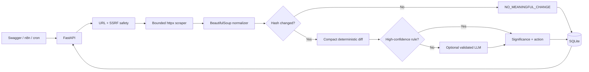
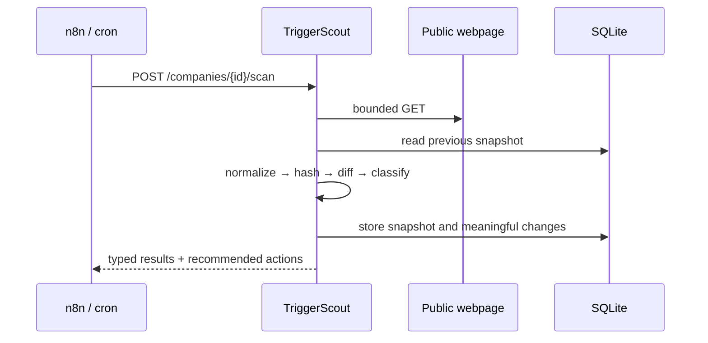

# TriggerScout

**Evidence-backed GTM signal monitoring for public company webpages.**

TriggerScout watches selected pages over time, removes webpage noise, computes compact deterministic diffs, and turns meaningful changes into safe, explainable GTM recommendations. It is built as a portfolio project for AI GTM Engineering: the emphasis is not a chat wrapper, but reliable signal collection, cost control, structured AI output, and automation-ready APIs.

> No frontend and no fake scheduler. Swagger at `/docs` is the demo UI; cron or n8n calls the explicit scan endpoint.

## The GTM problem

Account research becomes stale quickly. A company may begin hiring account executives, launch an enterprise tier, enter a new market, change pricing, or raise funding between sales touches. Manually revisiting every careers, news, product, and pricing page does not scale—and sending every full page to an LLM is expensive and noisy.

TriggerScout creates a durable monitoring loop:

- captures normalized snapshots of selected public pages;
- short-circuits identical content using SHA-256 hashes;
- excludes scripts, styles, navigation, cookie UI, copyright lines, and formatting noise;
- sends only compact added/removed excerpts through classification;
- applies high-confidence deterministic rules first;
- uses an optional OpenAI-compatible LLM only for ambiguous changes;
- validates AI output with Pydantic and fails safely to a conservative result;
- recommends research or review actions—never autonomous prospect contact.

## Architecture





See [docs/ARCHITECTURE.md](docs/ARCHITECTURE.md) for design decisions and trust boundaries.

## Cost-aware AI design

The most common result should cost no LLM tokens. Unchanged normalized content exits at the hash check. Known signals such as “raised $25M Series B” or “hiring 20 account executives” use auditable regular-expression rules. Only a compact, changed excerpt—not the original page—is eligible for semantic classification. An absent API key, timeout, HTTP error, or invalid JSON never prevents obvious signals from working.

## Trigger taxonomy

| Trigger | Example evidence | Default action |
|---|---|---|
| `HIRING_GROWTH` | Many general openings | `REQUALIFY_ACCOUNT` |
| `SALES_TEAM_EXPANSION` | Hiring AEs, SDRs, BDRs | `RESEARCH_ACCOUNT` |
| `FUNDING` | Raised a round or named amount | `CREATE_FOLLOW_UP` |
| `PRODUCT_LAUNCH` | Introducing a new product | `RESEARCH_ACCOUNT` |
| `ENTERPRISE_EXPANSION` | New enterprise plan/tier | `NOTIFY_SALES` |
| `MARKET_EXPANSION` | Availability in a new country/region | `REQUALIFY_ACCOUNT` |
| `NEW_OFFICE` | Office or headquarters opening | `RESEARCH_ACCOUNT` |
| `PRICING_CHANGE` | Updated price or packaging | `REVIEW_PRICING_CHANGE` |
| `NEW_INTEGRATION` | New native integration | `RESEARCH_ACCOUNT` |
| `PARTNERSHIP` | Partnership or alliance | `RESEARCH_ACCOUNT` |
| `LEADERSHIP_CHANGE` | New executive appointment | `CREATE_FOLLOW_UP` |
| `SALES_MOTION_CHANGE` | New demo/contact-sales CTA | `NOTIFY_SALES` |
| `GENERAL_CHANGE` | Material but ambiguous change | `RESEARCH_ACCOUNT` |
| `NO_MEANINGFUL_CHANGE` | Same hash or filtered noise | `NO_ACTION` |

Significance is `low`, `medium`, or `high` and is based only on detected evidence and trigger type. It is not a prediction of deal intent.

## Quick start

Requires Python 3.11+.

```bash
python -m venv .venv
source .venv/bin/activate
pip install -e '.[dev]'
cp .env.example .env
uvicorn app.main:app --reload
```

Open <http://localhost:8000/docs>. SQLite tables are created on application startup.

### Reliable interview demo: `/compare`

```bash
curl -s http://localhost:8000/compare \
  -H 'Content-Type: application/json' \
  -d '{
    "company_name": "Acme",
    "before": "We help small startups manage sales.",
    "after": "We are hiring 20 enterprise account executives across Europe."
  }'
```

Representative result:

```json
{
  "company_name": "Acme",
  "meaningful_change": true,
  "changes": [{
    "trigger": "SALES_TEAM_EXPANSION",
    "confidence": 0.94,
    "significance": "high",
    "before_excerpt": "We help small startups manage sales.",
    "after_excerpt": "We are hiring 20 enterprise account executives across Europe.",
    "why_it_matters": "Sales hiring indicates investment in revenue capacity and go-to-market growth.",
    "recommended_action": "RESEARCH_ACCOUNT"
  }]
}
```

More payloads live in [`examples/comparisons.json`](examples/comparisons.json). The 2–3 minute walkthrough is in [docs/DEMO.md](docs/DEMO.md).

## Monitoring API

Create an account to monitor:

```bash
curl -X POST http://localhost:8000/companies \
  -H 'Content-Type: application/json' \
  -d '{
    "name": "Acme",
    "website": "https://example.com",
    "pages_to_monitor": [
      "https://example.com/careers",
      "https://example.com/news",
      "https://example.com/pricing"
    ]
  }'
```

Then call `POST /companies/1/scan`. The first scan establishes a baseline; later scans compare against the latest snapshot. `POST /companies/{id}/snapshot` captures without classifying. Historical data is available from `GET /companies/{id}/snapshots` and `GET /companies/{id}/changes`.

| Method | Path | Purpose |
|---|---|---|
| `GET` | `/health` | Liveness check |
| `POST` / `GET` | `/companies` | Create/list monitored companies |
| `GET` | `/companies/{id}` | Read one company |
| `POST` / `GET` | `/companies/{id}/snapshot(s)` | Capture/list snapshots |
| `POST` | `/companies/{id}/scan` | Fetch, compare, classify, persist |
| `GET` | `/companies/{id}/changes` | List meaningful changes |
| `POST` | `/compare` | Database-independent text demo |
| `POST` | `/webhooks/scan` | Automation-friendly scan alias |

## n8n and cron

Import [`examples/triggerscout-n8n-workflow.json`](examples/triggerscout-n8n-workflow.json) and replace the base URL and disabled Slack placeholder. The documented flow is Schedule → list active companies → loop → scan → filter meaningful results → notify or update a CRM. See [docs/N8N_WORKFLOW.md](docs/N8N_WORKFLOW.md).

A minimal cron invocation is:

```cron
0 */6 * * * curl -fsS -X POST http://localhost:8000/companies/1/scan
```

## Docker

```bash
docker compose up --build
```

The API is exposed on port 8000 and SQLite data is kept in a named volume.

## Quality checks

```bash
pytest
ruff check .
ruff format --check .
mypy app --strict
```

## Configuration

All settings use environment variables; see `.env.example`. `OPENAI_API_KEY` is optional. `OPENAI_BASE_URL` can point at any compatible chat-completions provider. Network safety includes scheme/credential checks, DNS and IP validation, redirect revalidation, timeouts, limited retries, a response-size limit, and content-type checks.

## Limitations

- Public HTML only; JavaScript-rendered pages may need a browser-based fetch adapter.
- Webpage structure changes can still create low-confidence `GENERAL_CHANGE` results.
- The rule taxonomy is English-first and deliberately conservative.
- SQLite is appropriate for a single demo process, not high-concurrency production use.
- Robots.txt, site terms, crawl rates, and legal requirements remain the operator’s responsibility.
- There is no scheduler, authentication, CRM mutation, or autonomous outreach by design.

## Future improvements

- Per-domain crawl policies and rate limiting
- Semantic deduplication across pages and scans
- Evidence-aware clustering of related changes
- Postgres plus tenant authentication for production
- A queue-backed worker only when scan volume justifies it
- Evaluation datasets and rule/LLM precision dashboards
- Signed outbound webhooks and richer observability

## Screenshot placeholders

Add portfolio screenshots here after running the demo:

1. `docs/images/swagger-compare.png` — `/compare` request and response
2. `docs/images/scan-result.png` — a persisted company scan
3. `docs/images/n8n-workflow.png` — imported automation workflow

## Responsible use

TriggerScout observes public webpages and recommends internal next steps. It does not claim purchase intent, scrape private data, or contact people. Human review remains the final decision point.

