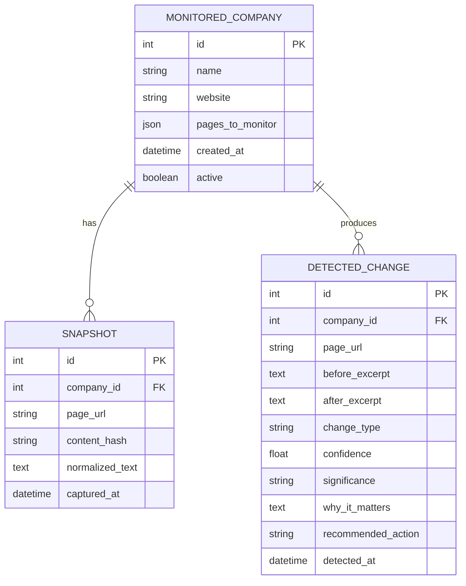

# Architecture

TriggerScout is a compact modular monolith. FastAPI owns the HTTP boundary, SQLAlchemy owns durable state, and focused services own fetching, normalization, diffing, classification, scoring, and recommended actions. This shape keeps the interview demo simple while preserving clean seams for production replacements.

## Request paths

### Direct comparison

`POST /compare` accepts two text values, normalizes both, compares stable hashes, builds a compact diff, and classifies the evidence. It uses normal application startup but does not read or write business records. This makes the core value proposition reliable to demonstrate without depending on live websites.

### Monitored scan

`POST /companies/{id}/scan` processes each configured page:

1. Load the latest stored snapshot for that exact URL.
2. Validate DNS/IP safety and fetch a bounded HTTP response.
3. Remove non-content elements and normalize whitespace/noise.
4. Store the new snapshot and its SHA-256 hash.
5. Return `NO_MEANINGFUL_CHANGE` immediately for a first baseline or equal hash.
6. Build only the added/removed excerpts with `SequenceMatcher`.
7. Apply deterministic trigger rules.
8. For unresolved material changes, optionally request an LLM classification.
9. Validate the model response and fall back to `GENERAL_CHANGE` on failure.
10. Persist meaningful detected changes and return typed results.

## Component boundaries

| Module | Responsibility |
|---|---|
| `url_safety.py` | Scheme, credential, host, DNS, and public-IP validation |
| `scraper.py` | Timeouts, retries, redirects, response type and size bounds |
| `normalizer.py` | HTML removal, noise filtering, stable text and hashes |
| `diff.py` | Compact deterministic before/after evidence |
| `classifier.py` | Ordered high-confidence rules and conservative fallback |
| `llm.py` | OpenAI-compatible call and Pydantic validation boundary |
| `significance.py` | Evidence-aware low/medium/high score |
| `actions.py` | Safe trigger-to-recommendation mapping |
| `snapshot.py` | Snapshot/change persistence and scan orchestration |

## Data model

## Security and reliability boundaries

- Only HTTP(S) URLs without embedded credentials are accepted.
- Literal and DNS-resolved loopback, private, link-local, multicast, reserved, and other non-global addresses are rejected.
- Every redirect target is revalidated to reduce redirect-based SSRF.
- Requests have bounded timeouts, retry counts, response sizes, and accepted content types.
- The LLM sees compact changed excerpts, not entire webpages.
- LLM JSON crosses a strict Pydantic schema; invalid output becomes a logged safe fallback.
- Recommendations are data. No service sends email or mutates a CRM.

For a public deployment, add authentication, tenant authorization, rate limiting, egress enforcement at the network layer, Postgres, migration tooling, and signed webhooks.

## Scheduling decision

TriggerScout deliberately excludes an in-process scheduler. In-process timers are fragile across restarts and multi-worker deployments. The idempotent manual scan API is the stable boundary: n8n, cron, GitHub Actions, or a cloud scheduler can call it according to the operator’s needs.

